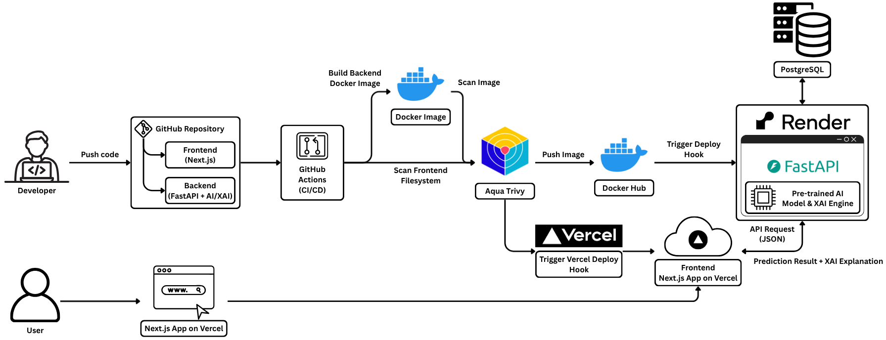

# AI-Based Heart Failure Prediction System with Explainable AI (XAI)
## Overview
End-to-end AI-powered heart failure prediction application that leverages machine learning models combined with Explainable AI (XAI) techniques to provide transparent and interpretable predictions based on patient clinical and health information.

* Data preparation and model training for heart failure prediction

* Explainable AI to interpret cardiovascular risk predictions

* Backend API for authentication, patient management, heart failure inference, XAI explanations and prediction history management

* Frontend web application for patient data input and result visualization

* CI/CD pipelines for automated build and deployment

## Features
* Heart failure risk prediction based on patient clinical data using trained AI models

* Explainable AI (XAI) to interpret model outputs (e.g. feature importance, SHAP values)

* RESTful backend API for prediction and user history

* Web-based frontend for data input and result visualization

* CI/CD pipelines for backend and frontend deployment

* Dockerized backend for portability and scalability

## Model & XAI Description
* Model: Logistic Regression, Random Forest, XGBoost,...

* Features:

| Feature | Type | Description |
| :--- | :--- | :--- |
| Age | Integer | Age of the patient (1–120 years) |
| Sex | String | Sex of the patient (`M`: Male, `F`: Female) |
| ChestPainType | String | Type of chest pain:<br>- `TA`: Typical Angina<br>- `ATA`: Atypical Angina<br>- `NAP`: Non-Anginal Pain<br>- `ASY`: Asymptomatic |
| RestingBP | Integer | Resting blood pressure (mm Hg) |
| Cholesterol | Integer | Serum cholesterol level (mm/dl) |
| FastingBS | Integer | Fasting blood sugar:<br>- `1`: Fasting blood sugar > 120 mg/dl<br>- `0`: Otherwise |
| RestingECG | String | Resting electrocardiogram results:<br>- `Normal`: Normal ECG<br>- `ST`: ST-T wave abnormality<br>- `LVH`: Left ventricular hypertrophy (Estes’ criteria) |
| MaxHR | Integer | Maximum heart rate achieved during exercise |
| ExerciseAngina | String | Exercise-induced angina:<br>- `Y`: Yes<br>- `N`: No |
| Oldpeak | Float | ST depression induced by exercise relative to rest |
| ST_Slope | String | Slope of the peak exercise ST segment:<br>- `Up`: Upsloping<br>- `Flat`: Flat<br>- `Down`: Downsloping |

* Output: Probability of heart failure along with corresponding XAI explanations

* XAI:
  - SHAP (SHapley Additive exPlanations)

  - LIME (Local Interpretable Model-agnostic Explanations)

## System Architecture
The following diagram illustrates the overall system architecture of the heart failure prediction application:



## Repository Structure
The repository is organized as follows:
```.
.
├── .github/
│   └── workflows/          # CI/CD pipelines for backend & frontend deployment
│
├── api/                    # Backend API (FastAPI)
│   ├── core/               # Core configuration, security, settings
│   ├── db/                 # Database connection and models
│   ├── routers/            # API route definitions endpoints
│   ├── schemas/            # Pydantic request/response schemas
│   ├── services/           # Business logic (prediction, XAI, auth)
│   ├── main.py             # FastAPI application entry point
│   ├── Dockerfile          # Docker image build configuration
│   └── requirements.txt    # Backend dependencies
│
├── input/                  # Datasets used for training AI models
│
├── notebooks/              # Jupyter notebooks for data analysis & model training
│
├── web/                    # Frontend web application (Next.js)
│   ├── app/                # App Router pages and layouts
│   ├── components/         # Reusable UI components
│   ├── context/            # React context (auth, global state)
│   ├── lib/                # API clients and helper functions
│   ├── types/              # TypeScript type definitions
│   ├── public/             # Static assets
│   ├── README.md           # Frontend-specific setup instructions
│   ├── package.json        # Frontend dependencies
│   └── next.config.ts      # Next.js configuration
│
├── requirements-dev.txt    # Development dependencies
└── README.md               # Project documentation
```

## Installation & Setup
Clone the repository:
```bash
git clone https://github.com/PDAnh77/Heart-Failure-Prediction-with-XAI.git
cd Heart-Failure-Prediction-with-XAI
```

### Backend (API)
1. Navigate to the api/ directory:
   ```bash
   cd api/
   ```

2. Create and activate a virtual environment (optional but recommended):
   ```bash
   python -m venv venv
   source venv/bin/activate  # On Windows use `venv\Scripts\activate`
   ```

3. Install the required dependencies:
   ```bash
   pip install -r requirements.txt
   ```
   
4. Run the API locally:
   ```bash
   uvicorn app.main:app --reload
   ```

Or build and run the Docker container:
   ```bash
   docker build -t heart-failure-api .
   docker run -d -p 8000:8000 heart-failure-api
   ```
   
### Frontend (Web Application)
The frontend has its own installation guide. Please refer to the [web/README.md](web/README.md) for detailed instructions on setting up and running the frontend application.

### Environment Variables
* Backend requires certain environment variables to be set for proper operation. Create a `.env` file in the `api/` directory with the following variables:
   ```
   DATABASE_URL=your_database_url
   DATABASE_KEY=your_database_key
   SECRET_KEY=your_secret_key
   API_URL=http://localhost:8000
   CLIENT_URL=http://localhost:3000
   ```

* If using Google OAuth for authentication, add these variables as well to the `.env` file:
   ```
   GOOGLE_CLIENT_ID=your_google_client_id
   GOOGLE_CLIENT_SECRET=your_google_client_secret
   REDIRECT_URL=http://localhost:3000/auth/callback
   ```

* For frontend environment variables, please refer to the [web/README.md](web/README.md).

### CI/CD Pipeline
CI/CD workflows are located in the `.github/workflows/` directory.
* Building backend Docker images

* Run Trivy security scans

* Deploying backend and frontend applications to hosting platforms

## Usage
1. Access the web application via your browser at `http://localhost:3000` (or the appropriate URL if deployed)

2. Input patient clinical and health information via the web interface

3. Submit the data to receive heart failure risk predictions along with XAI explanations

4. View and manage prediction history through the user dashboard (if enabled)

## Disclaimer
This project is intended for educational and research purposes only. It should not be used as a substitute for professional medical advice, diagnosis, or treatment. Always seek the advice of your physician or other qualified health provider with any questions you may have regarding a medical condition.
